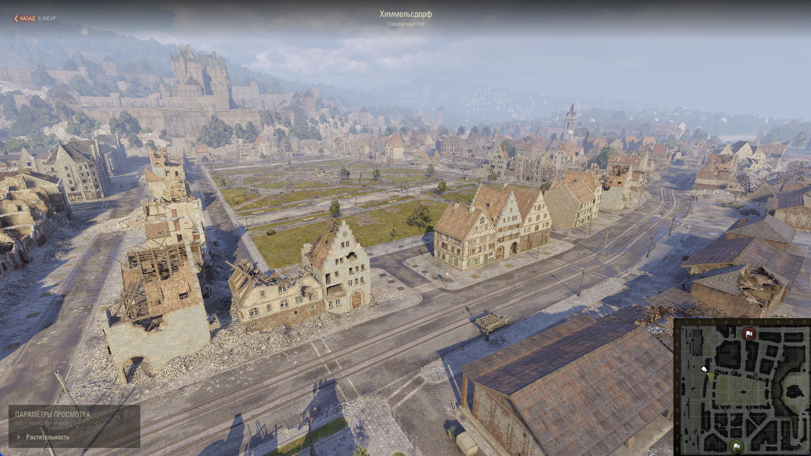
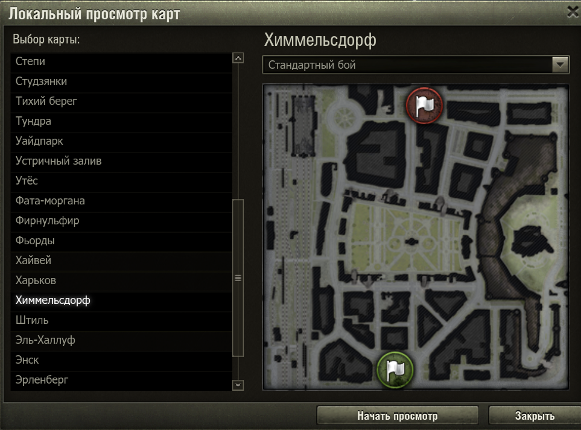
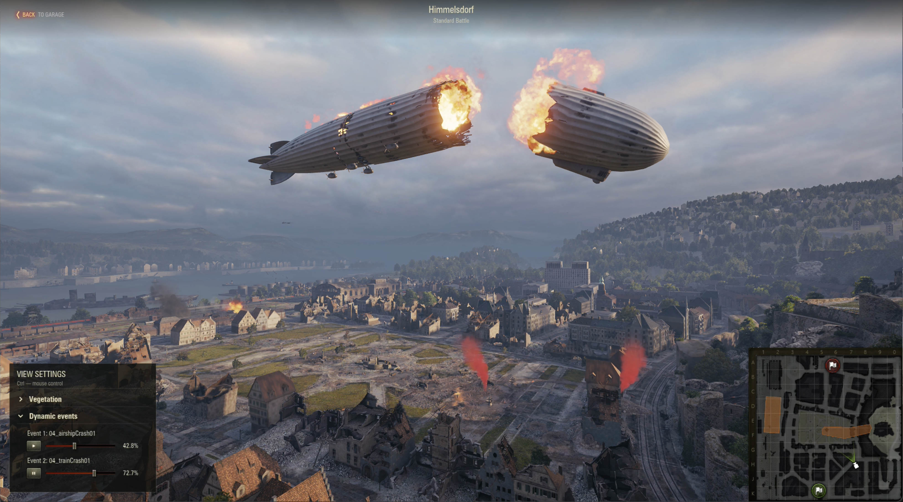

### | RU | [EN](./README_EN.md) |

# Local Map Viewer

Мод для Мира Танков и World Of Tanks который позволяет локально просматривать карты в клиенте игры.

## Установка
1. Скачайте файл мода [`wotstat.map-viewer_1.0.0`](https://github.com/wotstat/wotstat-map-viewer/releases/latest).
2. Поместите его в папку `Tanki/mods/{АКТУАЛЬНАЯ_ВЕРСИЯ_ИГРЫ}/`.

## Использование

- Через меню модов в ангаре включите мод
- В списке карт выберите карту, которую хотите просмотреть
- Выберите нужный режим
- Нажмите на кнопку "Начать просмотр" после чего загрузится выбранная карта поверх ангара.
- Вы можете перемещаться по карте свободной камерой, используя клавиши WASD и `Shift`/`Q` для снижения и `Space`/`E` для подъема камеры. Также можно использовать колесо мыши для изменения скорости и клавишу `Z` для зума, который можно уменьшать или увеличивать. 
- Для возврата в ангар нажмите клавишу `Esc` -> `Вернуться в Ангар` или `Ctrl` -> `Назад в Ангар`.

## Динамические события

В World of Tanks доступно меню динамических событий на картах которые это поддерживают. Такие карты обозначены в списке соответвующей подписью.

Запустив кару, в параметрах просмотра вы сможете увидеть раздел динамических событий. Каждое из которых можно запускать, ставить на паузу и проматывать в любом направлении.

## Расширения

Другие модификации могут добпалять свои разделы в параметры просмотра.