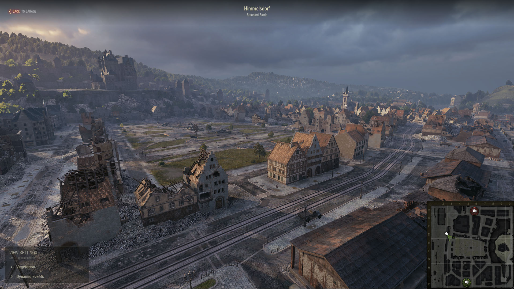
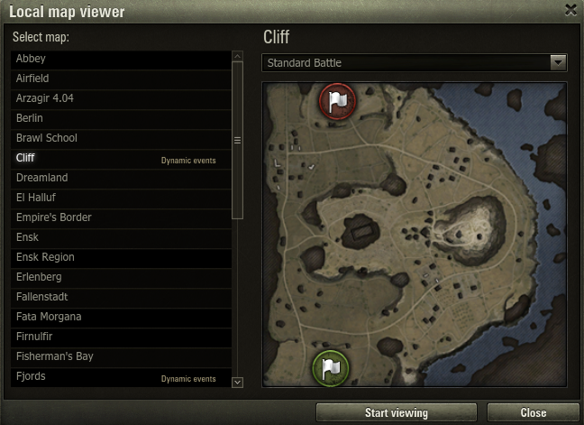

### | [RU](./README.md) | EN |

# Local Map Viewer

A mod for Мир Танков and World of Tanks that lets you explore maps locally in the game client.



## Installation

1. Download the [`wotstat.map-viewer_1.0.0`](https://github.com/wotstat/wotstat-map-viewer/releases/latest) mod file.
2. Place it in the `WOT/mods/{CURRENT_GAME_VERSION}/` folder.

## Usage

- Enable the mod from the Mods menu in the Garage.
- Select the map you want to explore from the map list.
- Select the desired mode.
- Click "Start Viewing". The selected map will load over the Garage.
- You can move around the map using the free camera. Use WASD to move, `Shift`/`Q` to lower the camera, and `Space`/`E` to raise it. You can also use the mouse wheel to adjust the movement speed and the `Z` key to zoom in or out.
- To return to the Garage, press `Esc` -> `Return to Garage` or `Ctrl` -> `Back to Garage`.



## Dynamic Events

World of Tanks includes a dynamic events menu for maps that support this feature. These maps are marked with a corresponding label in the list.

After launching a map, you will find the Dynamic Events section in the viewing settings. Each event can be started, paused, and scrubbed backward or forward.


## Extensions

Other mods can add their own sections to the viewing settings through the public API:

```python
from wotstat_map_viewer import debug_panel

SECTION_ID = 'my-mod'

def on_change(control_id, value):
  if control_id == 'enabled':
    print 'My mod enabled:', value

debug_panel.registerSection(SECTION_ID, u'My Mod', [
  dict(
    id='enabled',
    type='checkbox',
    label=u'Enable',
    value=False
  ),
], on_change)

# When unloading the mod:
debug_panel.unregisterSection(SECTION_ID)
```

Available element types: `checkbox`, `slider`, `dropdown`, `timeline`, and `text`.
