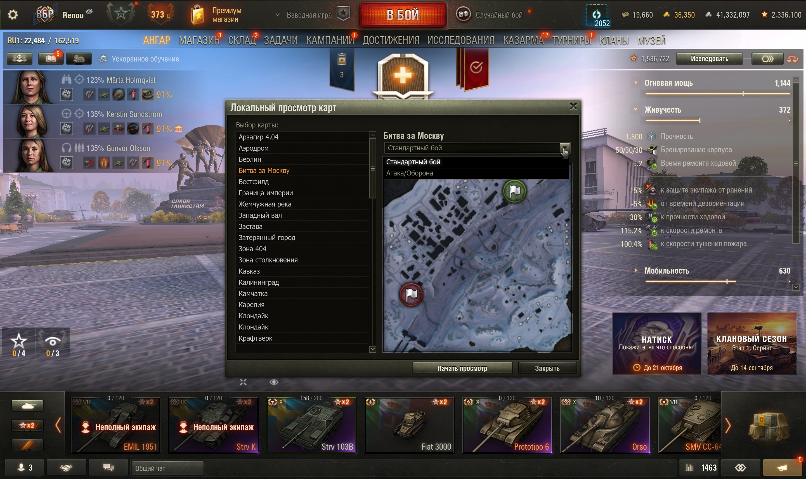
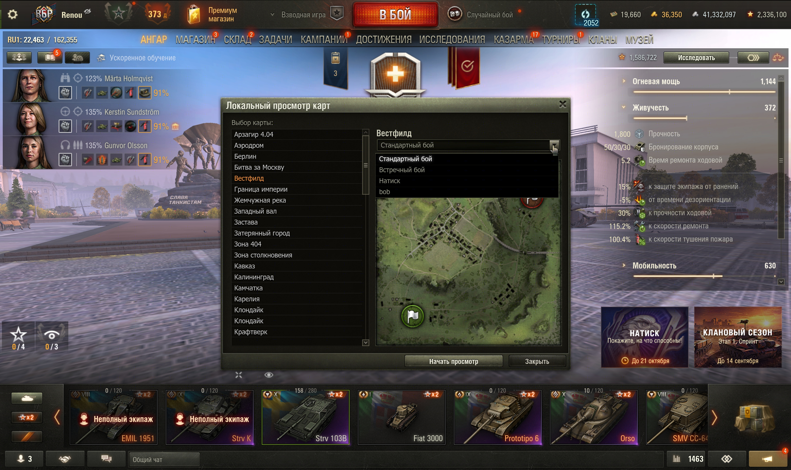
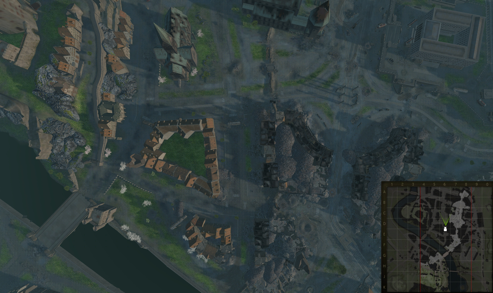
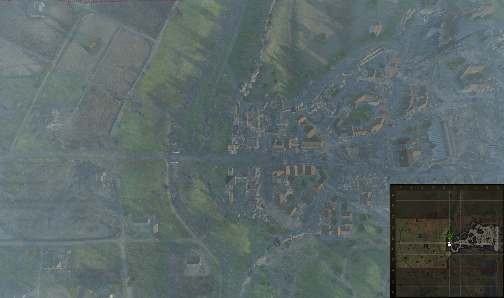
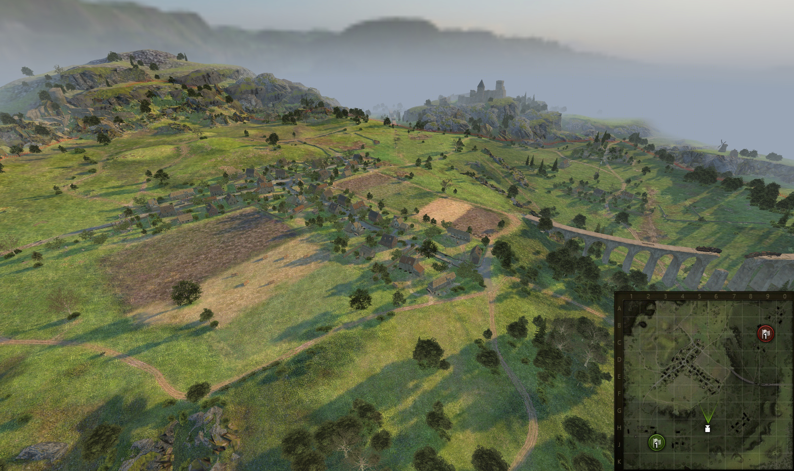
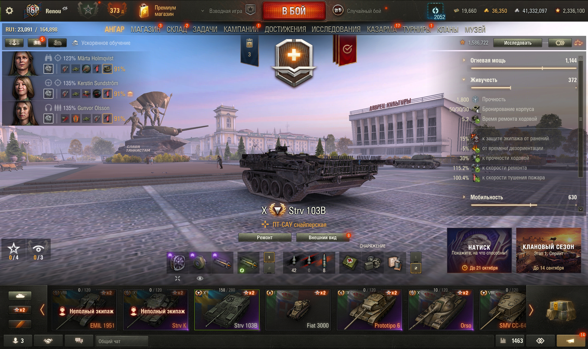

# Проверка версии 1.1.1

7 сентября 2026, «Мир танков» RU 1.45.0.0 #2269.
Сборка установлена и проверена после перезапуска клиента через WotStat REPL.
SHA-256 `.mtmod`: `768332d8f2f2876b157f9ad70cf02dac93db9b23da51f2f3d6607b5439420c78`.

| Исправление | Проверка в клиенте |
|---|---|
| Высота списка режимов по числу элементов | Арзагир 4.04 — 1 строка; Битва за Москву — 2; Вестфилд — 4. Штатный список открывался мышью через REPL |
| Координаты миникарты на прямоугольных картах | Одер — 6 точек; Западный вал — 5; обычный Вестфилд — 3. Все 14 проверок прошли |
| Кнопки в нижней панели окна | Удалён лишний отступ 12 px. Кнопки целиком внутри штатной панели; запуск и закрытие проверены мышью через REPL |

Одер (`108_normandy_nom`, 103) использует границы миникарты
`(-535, -535) … (515, 515)` вместо игрового прямоугольника
`(-200, -535) … (300, 515)`. Западный вал (`14_siegfried_line_nom`, 102)
использует `(-550, -550) … (550, 550)` вместо
`(-550, -250) … (550, 250)`. Это штатный расчёт
`StoryModeMinimapComponent.getBoundingBox`: обе оси текстуры используют длинную
сторону исходной границы. Граница в 3D и стартовая позиция камеры сохраняют
исходный игровой прямоугольник.

Координаты проверялись по фактическому `VideoCameraEntry` после обновления кадра:
центр текстуры, стартовая позиция, игровые границы и края текстуры.
Максимальное отклонение составило 0,05 в базовых координатах миникарты 210 × 210
(округление Scaleform). Превью обеих прямоугольных карт открывается без исключений;
его координаты передаются как `Math.Vector2`, требуемые штатным `MinimapLobby`.
У Одера ангарный PNG в самом клиенте содержит надпись `Template`; это исходный
ресурс игры. В просмотре используется полноценная игровая текстура `mmap.dds`.

Три цикла просмотра завершились возвратом исходных Account, ангара, окружения,
маски видимости и танка; список GUI-корней восстановлен, ошибок cleanup — 0.
На Одере проверен выход через штатное Esc-меню. После последнего цикла проверена
кнопка «Закрыть» в селекторе. В ходе трёх циклов просмотра ошибок Python
и Scaleform не обнаружено. Клиент закрыт, отсутствие процесса подтверждено.

Все **9 модульных тестов** прошли. Отдельная проверка кода завершена без оставшихся
замечаний. Полный перебор 65 карт и всех режимов не проводился.

Данные: [14 координатных проверок и возвраты](runtime-validation-1.1.1.json),
[целевой журнал мода](client-validation-1.1.1.log).

## Снимки

Две строки в списке и кнопки внутри нижней панели:

Четыре строки без пустого пространства снизу:

Одер: камера над улицей и соответствующая точка миникарты:

Западный вал: горизонтальная игровая граница внутри полной текстуры:

Проверка обычной квадратной карты и значков баз:

Исходный ангар после возврата:

