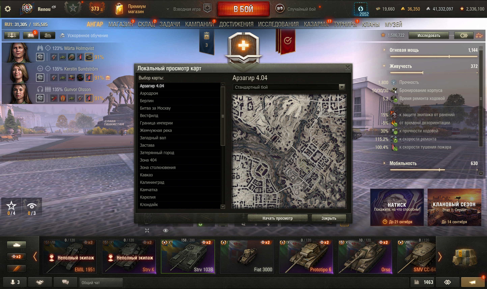
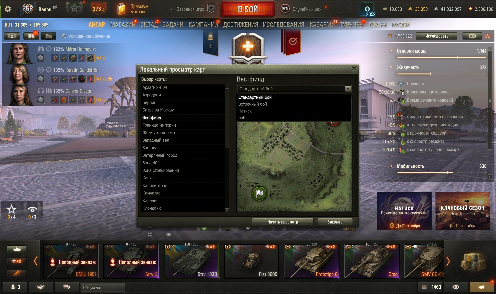
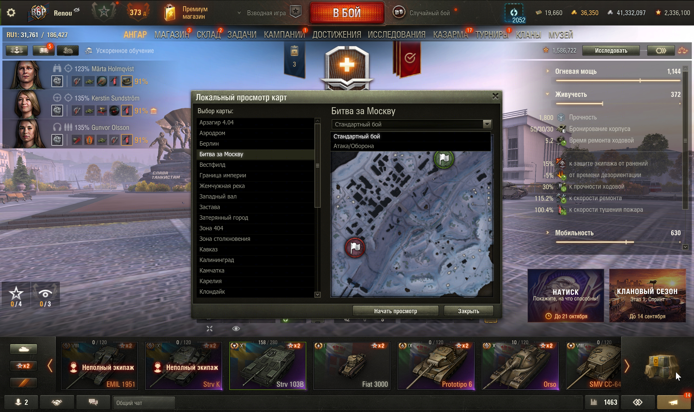
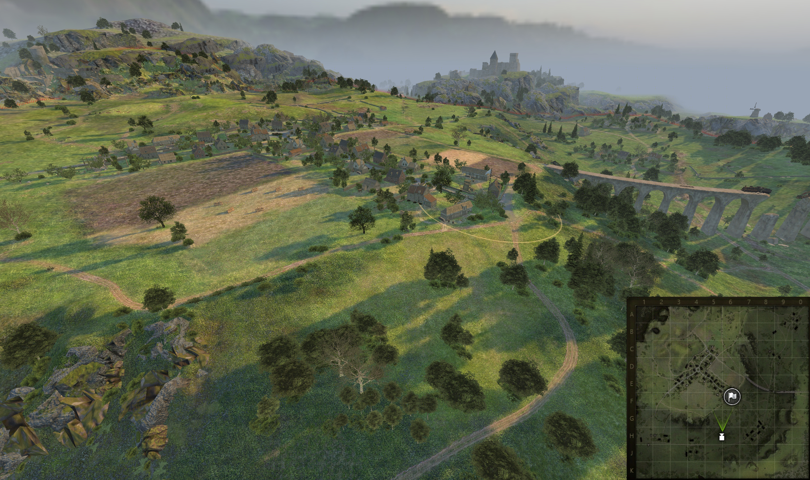
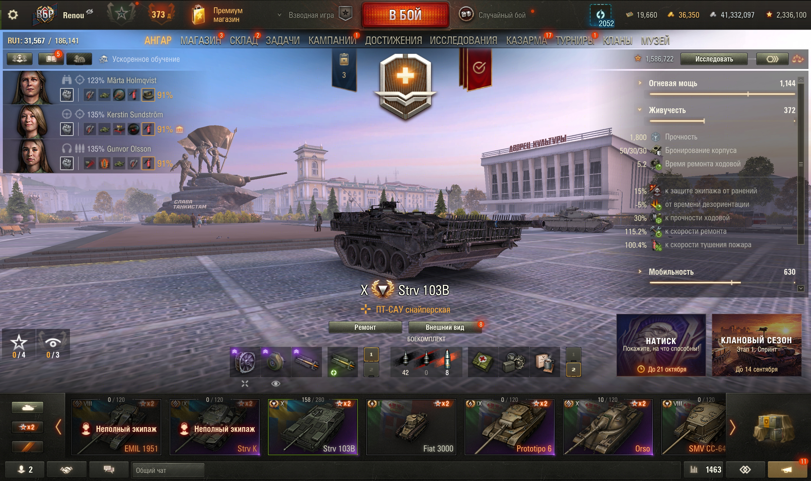

# Проверка 1.2.0 — собственное окно выбора карт

Дата: 7 сентября 2026, клиент «Мир танков» RU 1.45.0.0 #2269.
Итоговый `.mtmod` установлен в клиент и проверен после перезапуска.
Управление и диагностика выполнялись через WoT REPL.

## Изменение

Селектор теперь использует собственные `MapSelector` / `wotstatLocalMapsSelector.swf`
и Python `AbstractWindowView`. Наследование от `TrainingWindowMeta`, загрузка
`trainingWindow.swf`, поиск чужого окна на сцене и callback перестройки через
0,1 секунды удалены.

Слева находится список карт, справа — название, выбор режима и превью.
Кнопки находятся в нижней панели. Рамка, список, строки, dropdown, кнопки и
превью используют базовые компоненты клиента. Содержимое создаётся до передачи
данных и становится видимым сразу после их получения, без пустого кадра рамки.

## Проверено в итоговой сборке

- Первое открытие загружает библиотеку превью и собственный селектор; каталог — 65 карт.
- Повторное открытие через F8: первый сохранённый кадр уже содержит все элементы.
- Выбор Вестфилда, раскрытие списка из четырёх режимов и переключение на встречный бой.
- «Битва за Москву»: список ровно из двух режимов.
- Прокрутка колёсиком, переходы Home/End и доступ к последней карте — Эрленбергу.
- Закрытие кнопкой «Закрыть» и клавишей Esc. При раскрытом dropdown первый Esc
  закрывает список, следующий — окно, согласно штатному поведению.
- Нажатие «Начать просмотр» закрывает селектор и загружает Вестфилд,
  `arenaID=65559`, `gameplayName=domination`. Геометрия, граница и боевая миникарта отображаются.
- Выход через Esc → «Выйти в ангар»: все семь проверок восстановления успешны,
  `cleanupErrors=0`, набор корневых GUI-компонентов совпадает с исходным.
- Повторные открытия после выхода не оставляют дополнительных GUI-компонентов.
- Компиляция трёх SWF, упаковка Python 2.7 и 9 автоматических Python-тестов проходят.

В интервале работы итогового селектора и просмотра 18:57:44–19:02:10 ошибок
в `python.log` нет. При закрытии клиента в 19:02:11 повторились две ранее
наблюдавшиеся ошибки штатного сборщика отчётов об отсутствии папки для отчёта
(`helpers/styles_perf_toolset/report_generator.py`). Ошибок мода при закрытии нет.
Клиент после проверки закрыт; процесс `Tanki` отсутствует.

Данные: [runtime-validation-1.2.0.json](runtime-validation-1.2.0.json).
Журнал мода: [client-validation-1.2.0.log](client-validation-1.2.0.log).
Первый замер геометрии в JSON выполнен внутри populate до валидации рамки;
снимок уже отрисованного кадра показывает итоговое расположение элементов.

## Снимки

## Артефакт и границы проверки

`wotstat.local-maps_1.2.0.mtmod`, 58 322 байта, 18 файлов.
SHA-256: `af1d767691477f08d84cbae453caf5edc43e0a1032a5f1debf84b83631783f69`.
В архиве три собственных SWF; игровых классов и изменённых ресурсов клиента нет.

Этот прогон проверяет новый селектор и один полный цикл просмотра.
Геометрия всех 65 карт заново не проверялась. Предыдущие проверки координат
Одера, Западного вала и Вестфилда описаны в [отчёте 1.1.1](test-report-1.1.1.md).
