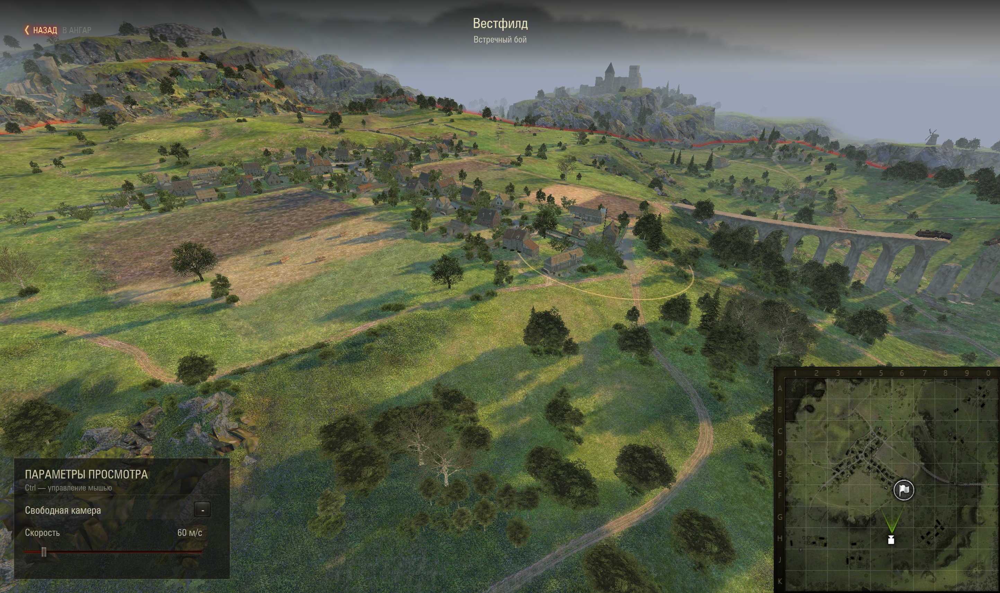
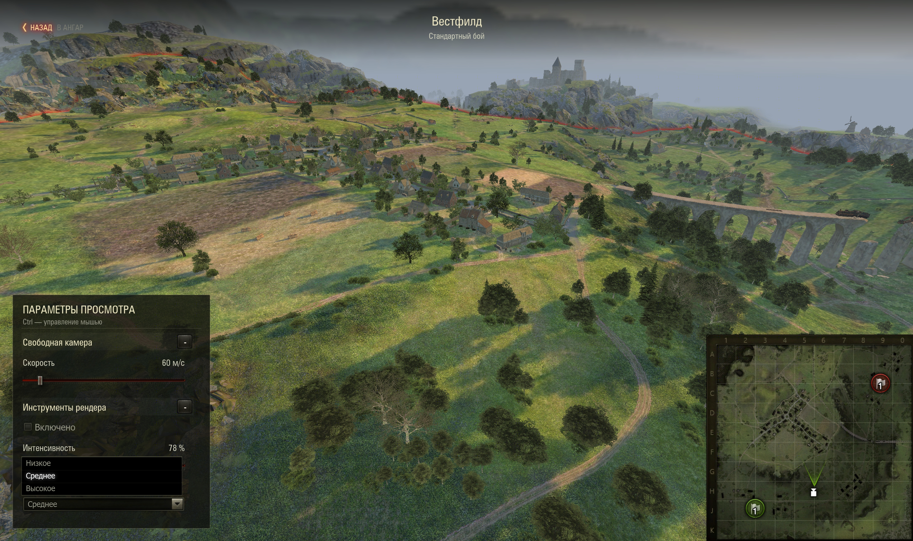
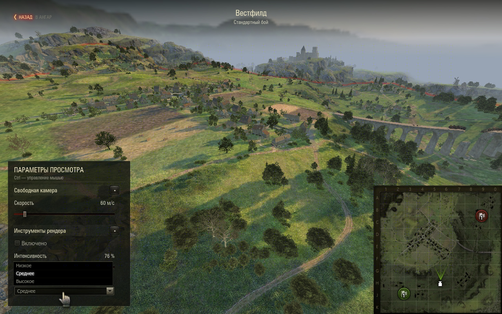
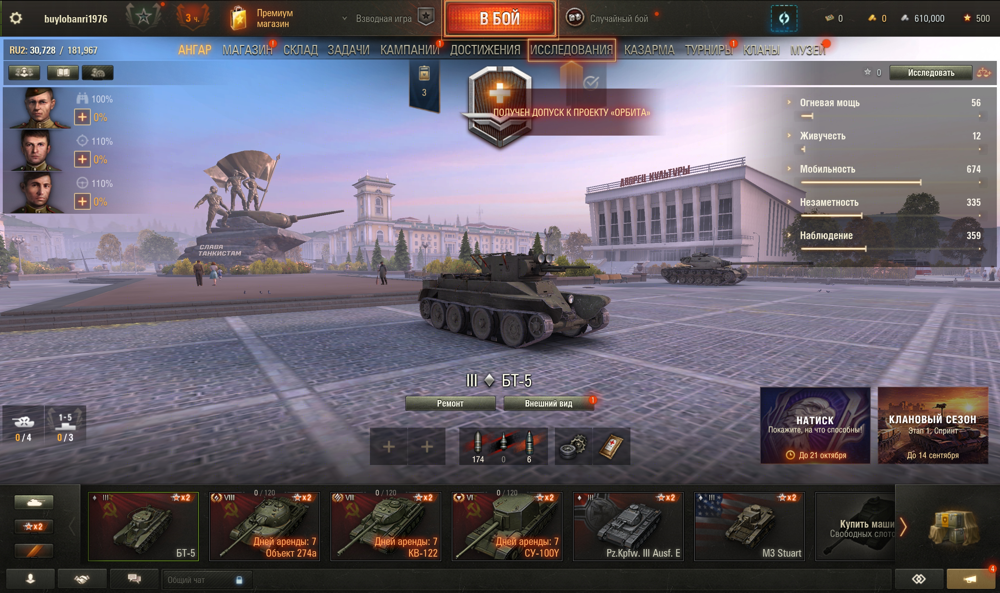

# Проверка 1.3.0 — управление просмотром и панель настроек

8 сентября 2026, «Мир танков» RU 1.45.0.0 #2269.
Итоговый архив установлен и проверен после перезапуска клиента.
Все действия в игре выполнены через WotStat REPL.

## Что добавлено

- Штатная кнопка «Назад в ангар» сверху слева, название карты и режима в шапке.
- Курсор по удержанию любого Ctrl. Камера останавливается на время работы с UI.
- Полупрозрачная панель снизу слева со сворачиваемыми секциями и прокруткой.
- Штатные Slider, CheckBox, DropdownMenu и ScrollBar для настроек других модов.
- Встроенная скорость свободной камеры, 5–500 м/с; слайдер и колесо синхронизированы.
- Публичный Python API регистрации и удаления секций, чтения и обновления значений.
  Пример: [debug-panel-api.md](debug-panel-api.md).

Точное движение перенесено с Ctrl на **C**; ускорение по Shift сохранено.

## Проверки

19 автоматических Python 2.7 тестов проходят. Проверены реестр, независимость
секций, типы значений, границы и некорректные числа, отсутствие обратного вызова
при программном обновлении, изоляция ошибок обработчиков и удаление секций.
Тесты извлечения библиотеки проверяют сохранение байткода без корневой привязки
и отклонение повреждённых SWF. Прежние проверки каталога, камеры, миникарты и
очистки также проходят. Все три собственных SWF компилируются.

В ходе проверки UI подтверждены сворачивание и раскрытие секций, прокрутка до
последнего из 15 добавленных чекбоксов, программное обновление без повторного
вызова обработчика, синхронизация колеса со слайдером и расположение списков
у нижней границы экрана.

В последнем прогоне установленного архива выполнены 22 проверки состояния:

- Загрузка Вестфилда со штатным HUD; реальная мышь через виртуальный ввод REPL
  меняет чекбокс, слайдер и dropdown сторонней секции. Обработчик получает
  `False`, `78.0`, `'high'`, затем `True` при повторном нажатии чекбокса.
- Удаление секции с фокусом на чекбоксе, последующее открытие Esc-меню и настроек.
  Добавление и удаление секции за открытым окном настроек не отбирает его фокус.
- Удержание обоих Ctrl и отпускание одного, остановка камеры, изменение её
  скорости слайдером и завершение перетаскивания при отпускании последнего Ctrl.
- Изменение размера окна с 2887×1714 до 1280×800 и обратно. Шапка, панель и
  миникарта перестраиваются; исходный размер окна восстановлен.
- Выход верхней кнопкой. Повторное открытие селектора через F8: 65 карт.
- Второй запуск Вестфилда во встречном режиме (`arenaID=65559`), сохранение
  скорости и повторный выход верхней кнопкой, в том числе с быстрым отпусканием Ctrl.
- После обоих выходов восстановлены Account, танк, ангар, окружение и видимость;
  `cleanupErrors=0`. Корневые GUI-компоненты совпадают с исходными, подписка HUD
  на реестр настроек снята.

Итоговые данные: [runtime-validation-1.3.0.json](runtime-validation-1.3.0.json).
Журнал мода: [client-validation-1.3.0.log](client-validation-1.3.0.log).
Вывод unit-тестов: [unit-tests-1.3.0.log](unit-tests-1.3.0.log).

За итоговый интервал 21:35:24–21:41:41 ошибок в `python.log` нет. При открытии
меню зарегистрировано предупреждение штатного Scaleform о `viewId` у View stack.
Клиент закрыт после проверки. При завершении в 21:41:44 повторились две ранее
наблюдавшиеся ошибки штатного сборщика отчётов: отсутствует путь для отчёта.

## Исправления по результатам проверки

Dropdown выбирает направление по свободному месту и ограничивает число видимых
строк, чтобы пункты оставались доступны. HUD слушает штатный `StageResizeEvent`.
Перед пересозданием секций и отключением ввода используется
`AbstractView.setFocus(this)`: удалённый контрол больше не остаётся в истории
фокуса и не вызывает ошибки при возврате из меню.

## Снимки

## Артефакт и границы проверки

`wotstat.local-maps_1.3.0.mtmod`: 79 959 байт, 20 файлов.
SHA-256: `2a675515b14e55bffe480ed80aba1165e35e1e0c8bfb992992332fd574940b2c`.
Установленная копия совпадает с архивом в `dist`.

В мод включены Python bytecode и три собственных SWF. Реализации ангарных
контролов читаются из установленного клиента в память без запуска корневого
`LobbyApplication`; игровые классы и ресурсы в архив не включены.
Проверка относится к новому UI, вводу и двум циклам просмотра Вестфилда.
Геометрия всех карт повторно не проверялась. Значения настроек сохраняются между
просмотрами в текущем процессе; запись настроек других модов на диск остаётся
ответственностью их владельцев.
