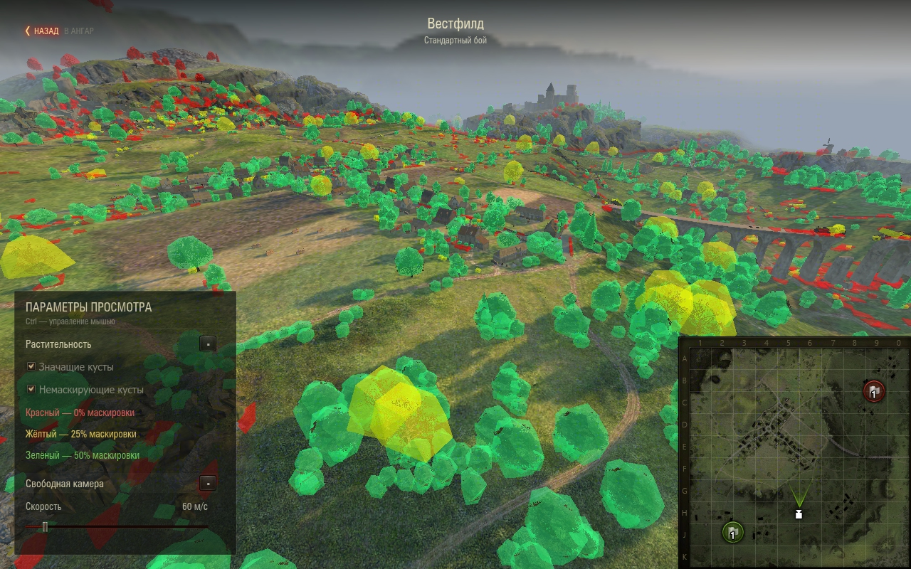
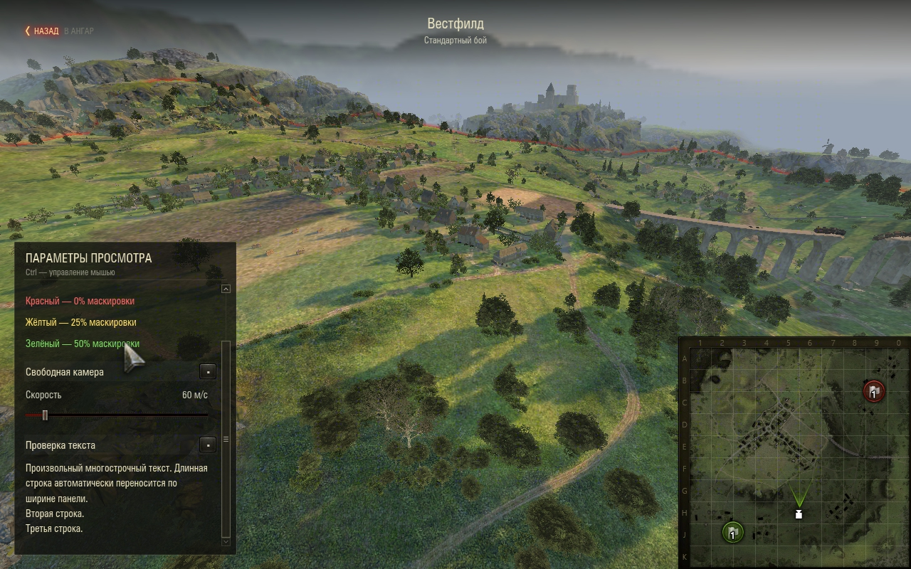
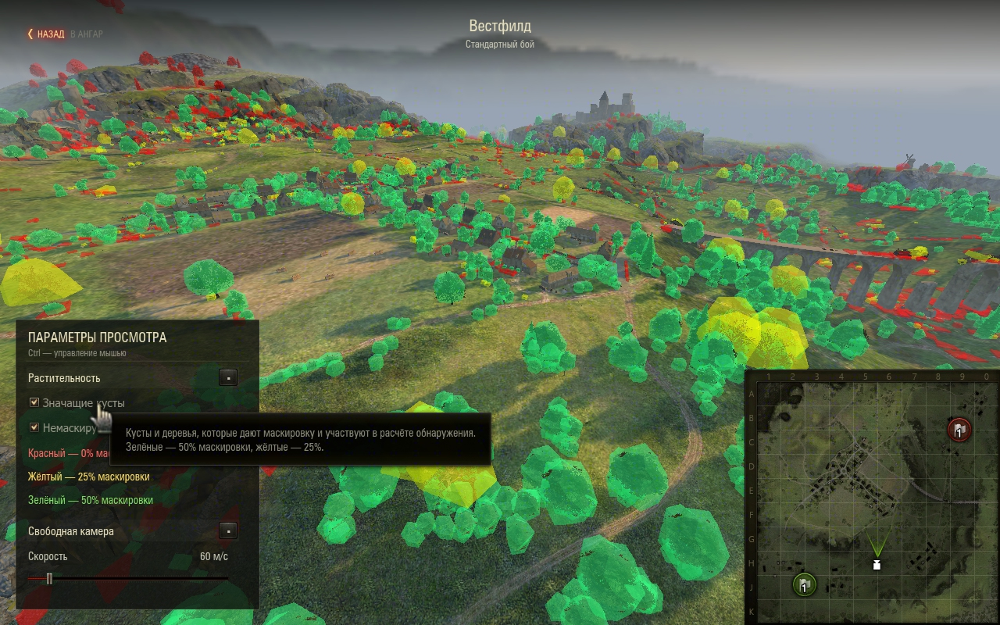

# Интеграция растительности — 1.4.0

Проверка 8 сентября 2026, «Мир танков» RU 1.45.0.0 #2269,
`wotstat.local-maps` 1.4.0 и `wotstat.vegetation` 1.2.0.

22 unit-теста Python 2.7 проходят; собраны все три SWF. Новые проверки реестра
покрывают текстовые строки, подсказки и недопустимые цвета. Проверка событий
покрывает неизменяемый контекст, снятие подписки, отсутствие дублей и изоляцию
ошибки стороннего слушателя. Windows-сборка vegetation создаёт оба архива;
компиляция не оставляет `.pyc` в исходном `res/`.

## Проверка в клиенте через WotStat REPL

- Вестфилд, стандартный режим: оба чекбокса изначально выключены.
- Реальная виртуальная мышь REPL включает категории независимо: только
  маскирующие — 4 274 модели (3 677 зелёных, 597 жёлтых); только немаскирующие —
  3 278 красных; обе категории — 7 552 модели.
- Подсказки секции и обоих чекбоксов отображаются штатным менеджером.
  Три строки легенды имеют правильные цвета и значения.
- Выключение обоих чекбоксов и серия быстрых переключений оставляют ноль моделей
  и ни одного ожидающего callback.
- Выход во время незавершённой загрузки (создано 317 моделей) отменяет callback.
  Сохранённые ссылки на модели после выхода имеют `inWorld=False`.
- Повторный вход через F8 во встречный режим передаёт `gameplayID=1`, маску 2
  вместо 1 и новое пространство. Оба чекбокса снова выключены; немаскирующая
  категория загружается повторно. Выход проверен верхней кнопкой с Ctrl.
- После обоих выходов восстановлены Account, ангар, танк, окружение, маска и GUI;
  `cleanupErrors=0`, модели и данные карты освобождены, callbacks отсутствуют,
  подписка HUD на настройки снята. Подписка vegetation на будущие запуски остаётся
  ровно одна. События каждого просмотра: `ready`, `stopping`, `stopped`.
- После установки окончательного пакета с упрощёнными текстами подсказок
  выполнен ещё один запуск: обе категории дают те же 7 552 модели. В окне
  1280×800 проверены окончательная подсказка, перенос длинной текстовой строки,
  явные переводы строк и прокрутка до конца. Проверочная секция удалена;
  исходный размер окна 2887×1714 восстановлен.

Числовые результаты: [runtime-validation-1.4.0.json](runtime-validation-1.4.0.json).
За интервал двух циклов просмотра новых ошибок в `python.log` нет.
При завершении клиента повторяются ранее отмеченные штатные ошибки сборщика
отчётов, не связанные с просмотрщиком.

## Пакеты

Вьювер: `dist/wotstat.local-maps_1.4.0.mtmod`, 83 702 байта, 21 файл.
Vegetation: `wotstat.vegetation_1.2.0.mtmod`, 129 736 байт, 26 файлов.
Установленные копии совпадают с собранными по SHA-256. Архивы содержат только
байткод и собственные ресурсы модов; игровые файлы не заменяются.

Проверены два режима Вестфилда; все карты, настоящие бои и клиент Wargaming
повторно не проверялись. Ограничения vegetation для боевых режимов не изменены.

## Снимки окончательной сборки

