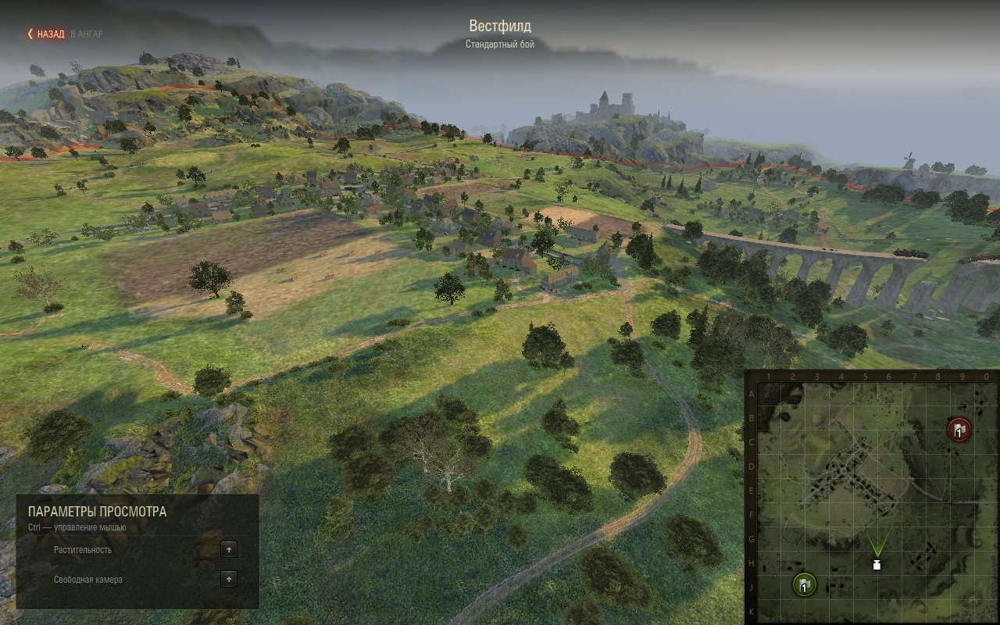
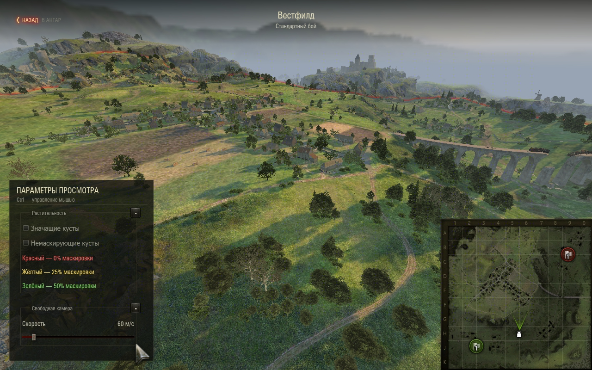
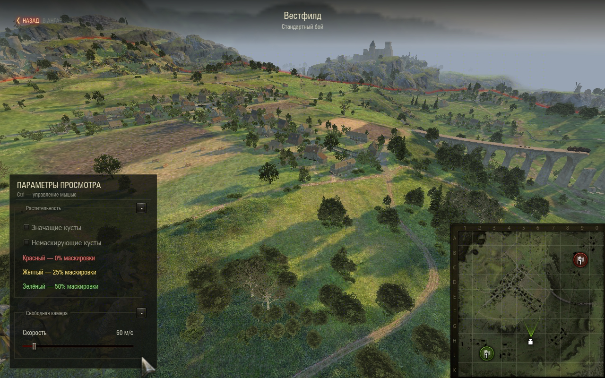
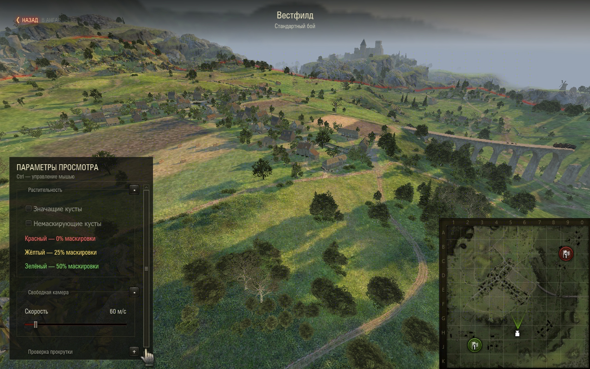
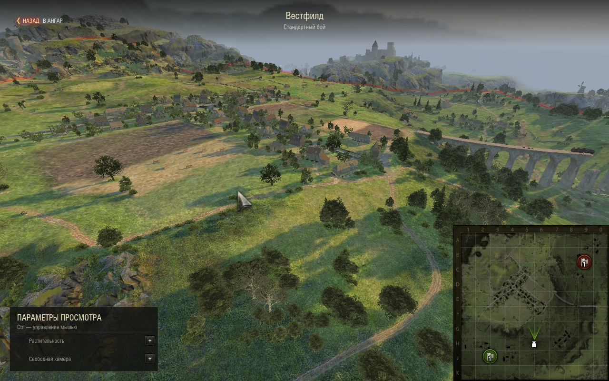

# Оформление групп — 1.4.1

Проверка 8–9 сентября 2026, «Мир танков» RU 1.45.0.0 #2269,
`wotstat.local-maps` 1.4.1 и `wotstat.vegetation` 1.2.0.

22 unit-теста Python 2.7 проходят; собраны все три SWF. Установленный пакет
совпадает с `dist/wotstat.local-maps_1.4.1.mtmod` по SHA-256:
`b6f8ff561cb898be346116fd551b492b5e349c6c14a5f59f4e51ca6fed2c15da`.

## Проверка через WotStat REPL

- Вестфилд, стандартный режим, окно 1280×800: обе группы изначально свёрнуты,
  рамки скрыты, остаются маленький заголовок и кнопка «+».
- Раскрытие показывает штатный `FieldSet`: рамка окружает все контролы,
  кнопка сворачивания расположена в правом верхнем углу.
- Обе группы можно открыть одновременно и независимо свернуть.
- Добавление и удаление временной секции сохраняет состояние существующих
  групп. Новая секция свёрнута; длинный заголовок сокращается до кнопки.
- Повторный вход снова сворачивает группы; возврат восстанавливает Account,
  ангар, машину, окружение и GUI. `cleanupErrors=0`.
- В свежем просмотре обычные клики REPL независимо включают оба чекбокса,
  после сворачивания и раскрытия выключают их: ноль моделей, callback отсутствует.
  Ползунок изменяет скорость с 60 до 152 м/с; верхняя кнопка возвращает в ангар.
  Проверочное значение и исходный размер окна 2887×1714 восстановлены.

При диагностике обнаружено, что вызов `resync()` у корневого
`hud.flashObject` нарушает последующую передачу событий Flash → Python.
Проверять клики нужно в свежем просмотре без этого вызова; одной повторной
установки `flashObject.script` недостаточно. Это особенность диагностического
доступа, а не обычного сценария работы панели.

## Снимки установленной сборки

9 сентября уменьшены внешние поля и увеличены внутренние отступы рамок.
Три SWF пересобраны; обновлённый пакет установлен и визуально проверен через
REPL при 1280×800. Обе группы раскрываются без обрезки контролов.

Затем поля выровнены: видимые края рамок отстоят от панели на 16 px слева
и справа, левый край совпадает с началом текста заголовка. Учтены прозрачные
поля `FieldSet`. Проверены обе раскрытые группы.

В окончательной сборке скроллбар расположен внутри панели. При переполнении
рамки, заголовки и контролы сужаются на 24 px; текст заново переносится по ширине.
Проверено добавлением секции с длинным текстом и выпадающим списком:
прокрутка достигает последней строки, элементы не перекрывают скроллбар.
Ползунок в суженной группе изменяет скорость. Сворачивание группы убирает
переполнение и восстанавливает полную ширину, в том числе у текста и списка.
Повторное раскрытие возвращает скроллбар; удаление временной секции снова
восстанавливает симметричные поля. Значения настроек при переразметке сохраняются.

Подпись «В АНГАР» осветлена до `#CCCCCC`, непрозрачность её `textMc` поднята
со штатных ~60% до 80%. Цвет проверен в собранном SWF, окончательная
непрозрачность — через REPL на штатном экземпляре кнопки; те же параметры
включены в окончательный пакет. При наведении
и уходе курсора значение 0.9 сохраняется.

