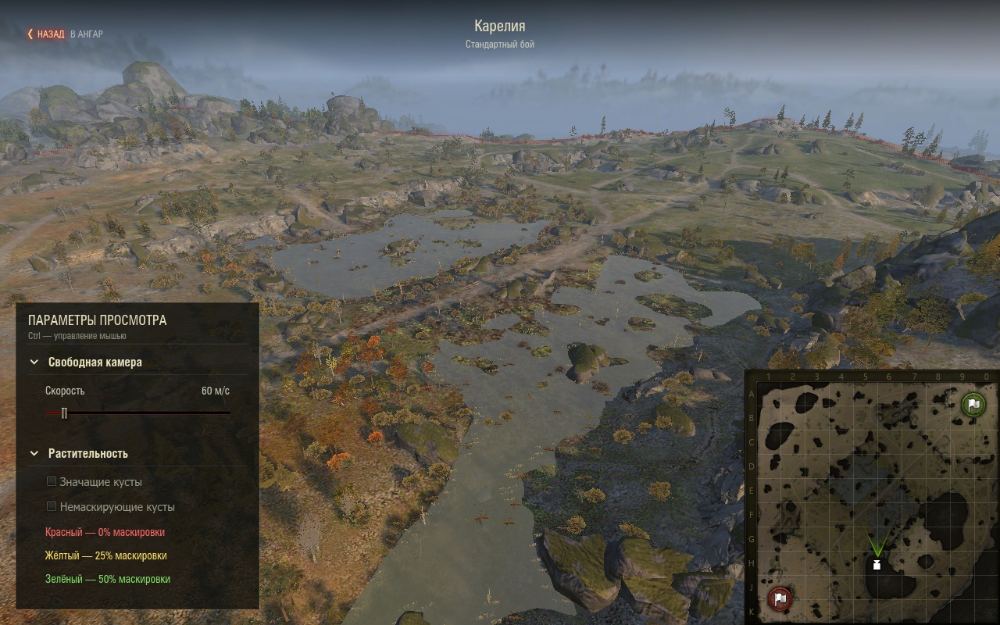
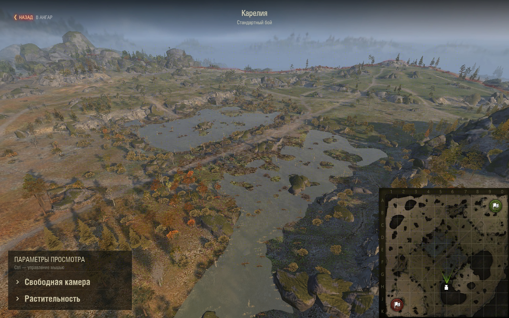
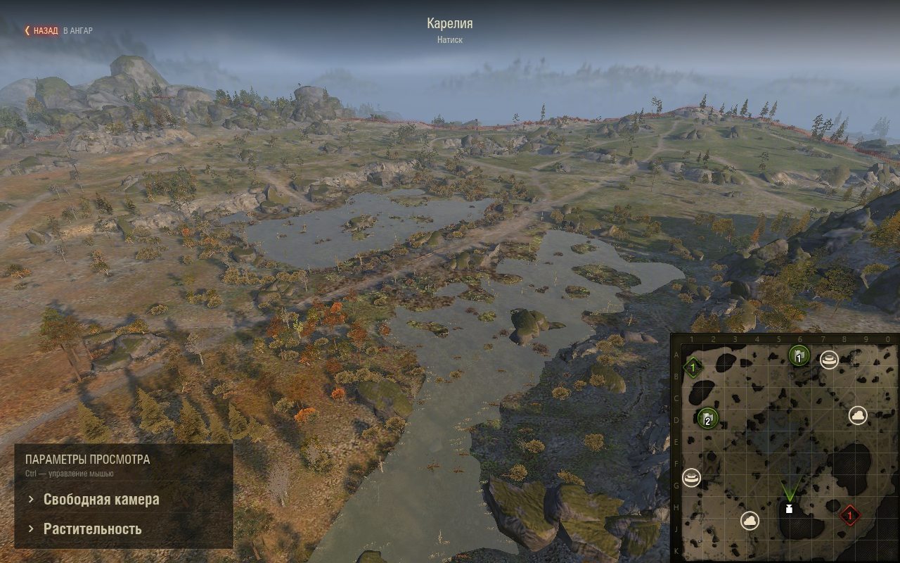
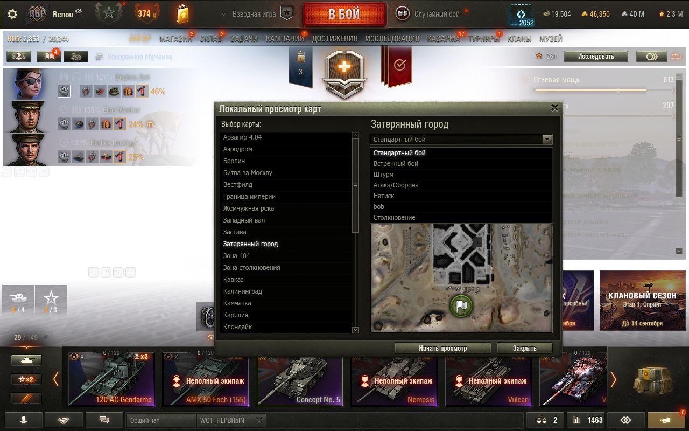
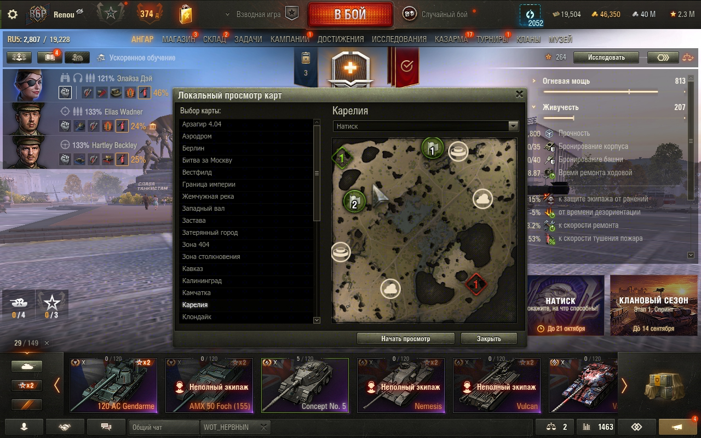

# Проверка 1.4.2 через WotStat REPL

11 сентября 2026, «Мир танков» RU 1.45.0.0 #2269.
Пакет установлен при закрытой игре, клиент перезапущен через REPL.
SHA-256 окончательного пакета в `dist` и установленной копии совпадает:
`bcd1bfd05fdd45ccf9e8501e505cf87b42b97f700f87f4eeda9bd9a9cc79aba5`.

- Карелия, стандартный бой: две базы без номеров и маркер камеры.
- Карелия, встречный бой: два респауна, нейтральная база без номера и камера.
- Карелия, «Натиск»: две базы, два спавна, четыре точки абилок и камера.
- Нажатие на текст заголовка раскрывает секцию; повторное нажатие сворачивает.
  Обе секции открываются независимо, стрелки поворачиваются, рамок нет.
  Новый просмотр начинает со свёрнутых секций.
- После каждого из трёх режимов восстановлены Account, ангар, машина,
  окружение и visibility mask; `cleanupErrors=0`.
- Проверка обнаружила сброс ширины изображения штатным загрузчиком превью
  до 300 px. Исправление: масштабируется весь штатный компонент 300 → 340 px,
  включая сетку и маркеры; расчёт точек остаётся в системе координат 300 px.
  После пересборки, установки и второго перезапуска проверены смена карты,
  выбор «Натиска», полный размер текстуры и ширина выпадающего списка.
- Селектор проверен при 1280×800 и 2887×1714. Исходный размер окна восстановлен,
  клиент оставлен в ангаре с установленной окончательной сборкой.
- После уточнения оформления заголовки секций уменьшены до 16 px при общем
  заголовке 17 px, высота строки — до 32 px. Раскрытие обеих секций проверено
  обычными кликами через REPL на переустановленной сборке.
- Уточнение ширины: `hitMc` не соответствует видимой рамке scale9-оформления.
  Расчёт по его границам оказался неверным и удалён. Установлены ширина
  компонента 346 px и x=283, учитывающие поля оформления по 3 px с каждой
  стороны. Поповер остаётся 340 px при x=286. Видимые края проверены на PNG
  закрытого и раскрытого селектора через REPL при 1280×800.

26 unit-тестов Python 2.7 проходят, все три SWF собраны. В интервале просмотра
нет ошибок мода; отдельно в логе присутствуют сообщения клиента/Gameface при
изменении размера окна и сообщения фоновых потоков при завершении клиента.

