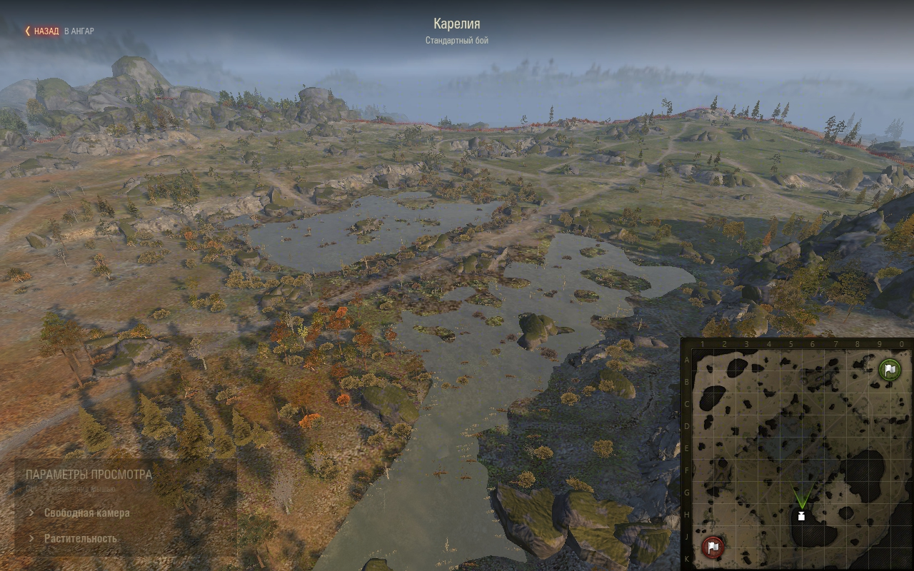
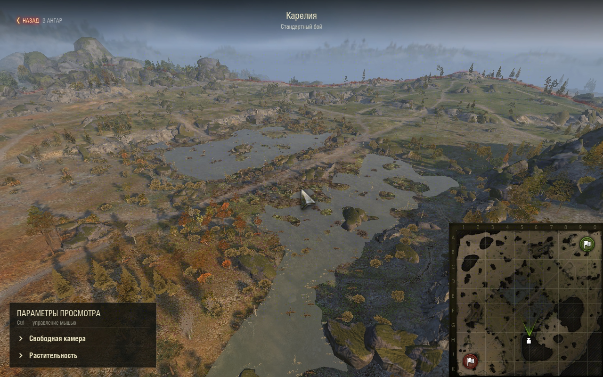
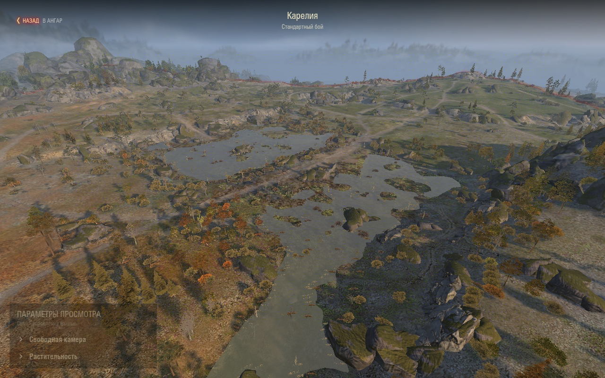
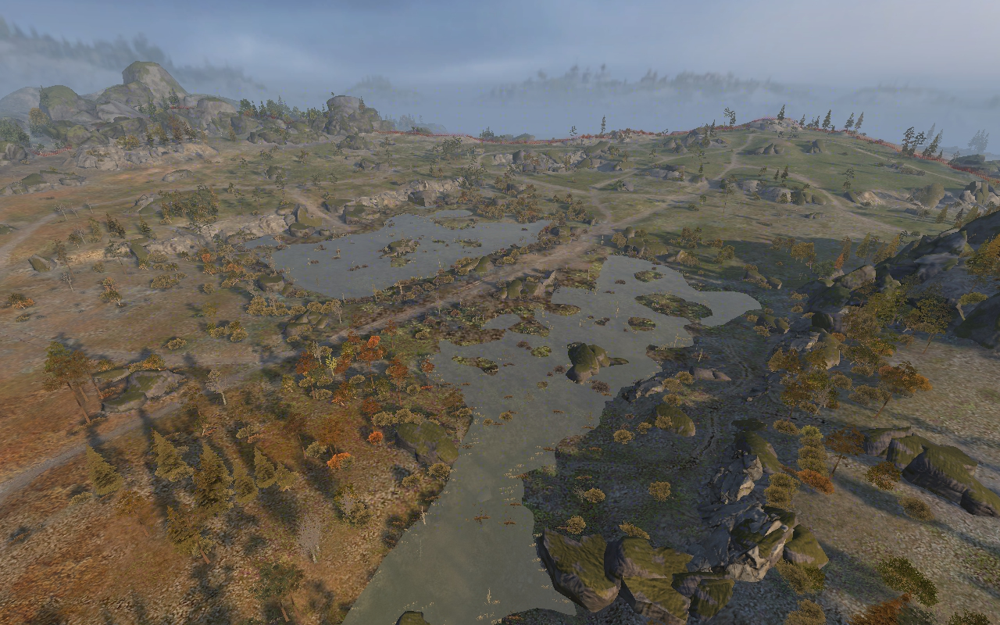
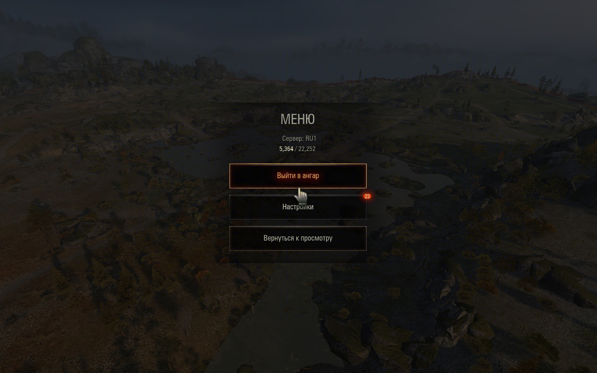

# Курсор и видимость интерфейса — 1.4.3

11 сентября 2026, «Мир танков» RU 1.45.0.0 #2269, Карелия,
локальный просмотр из ангара. Проверено через WotStat REPL на установленном
пакете 1.4.3 после перезапуска клиента. SHA-256 пакета в `dist` и игре:
`2a7806a4947d463737949da8e413b49166d24e78c97ab04ea8fc4236fa934645`.

- Движение мыши изменило yaw/pitch с `(0, 0.5)` до `(0.22, 0.58)`;
  скрытый курсор остался в `(0, 0)`. Нажатие Ctrl показало его в центре.
- При Ctrl курсор свободно движется, камера не вращается. Дополнительное
  нажатие второго Ctrl и отпускание первого не сбрасывают его положение.
  После отпускания обоих курсор скрывается и возвращается в центр.
- Панель без Ctrl имеет alpha=0.40, при Ctrl — 1.0; результат проверен
  скриншотами на одном ракурсе.
- M скрывает и возвращает миникарту. V скрывает всю шапку, панель и миникарту;
  после повторного V сохраняется выбор M. Проверены Python-флаги и изображения.
- Esc открывает штатное меню поверх скрытого HUD. В меню M/V не меняют флаги;
  Escape возвращает к просмотру с прежней видимостью и курсором в центре.
- После возврата HUD обычный клик по заголовку раскрывает секцию. V работает
  также при удержании Ctrl. Повторный вход сбрасывает оба флага видимости.
- Возврат восстанавливает ангар, Account, машину, окружение и visibility mask;
  `cleanupErrors=0`. Исходный размер окна восстановлен.

26 unit-тестов Python 2.7 проходят; три SWF собраны. В затронутых сценариях
ошибок мода не обнаружено.

Дополнительная правка окна выбора карты: нижние кнопки сдвинуты вправо на
14 px. Правый край «Закрыть» совпадает с краем содержимого, как у штатных
настроек (`x + width = 640`); промежуток между кнопками сохранён. После
пересборки и перезапуска проверены положение и закрытие окна кликом через
REPL при 1280×800. Клиент возвращён в ангар, размер 2887×1714 восстановлен.
SHA-256 обновлённого пакета в `dist` и игре:
`774384bb9a070e529494e0bd584785f317429e3413e763da1e5bfe6ae5791e7e`.

Непрозрачность панели без Ctrl затем повышена с 40% до 60%. На установленной
пересборке через REPL подтверждены alpha=0.60, при Ctrl — 1.0, после отпускания
снова 0.60; видимость проверена скриншотом на Карелии. SHA-256 этой сборки
в `dist` и игре: `963fd9a4adc4f88560b47042e2459630624d28a5c007d846ef0bd6f2371e23c6`.

